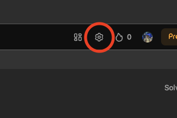
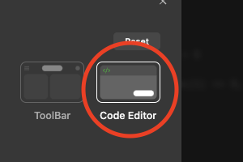
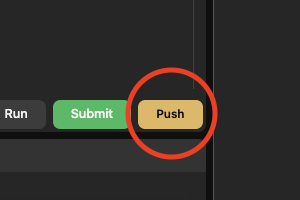

# LeetPush Chrome Extension

## Stay Focused on Solving, Let _LeetPush_ Handle the Pushing!

### Features:

- Conveniently pushes your LeetCode solutions directly to your GitHub
	repository.
- Saves you time and effort in manual code transfers.

### Dependencies:

- LeetPush has no external dependencies. It is built using vanilla JS.

### Installation:

- Visit [LeetPush Extension]().
- Click "Add to Chrome" to install the extension.

### Usage:

    
The extesniosn works only on Code Editor Layout

    
		 
		 
    
		 
		 
    

**_One-Time Setup:_**

- [Generate a GitHub token with access to only a specific repository](https://scribehow.com/shared/Generating_a_personal_access_token_on_GitHub__PUPxxuxIRQmlg1MUE-2zig).
- Grant the "repo" scope to allow the extension to push code to your
	repositories.
- Access a LeetCode problem and click the "Push" button (located next to the
	submit button).
- Enter your Repository URL, personal access token, and desired branch.
- Click "Submit" to complete the setup.

**_Pushing Solutions:_**

- Solve the LeetCode problem you want to push.
- Submit your solution.
- Click the "Push" button.
- Your code will be seamlessly transferred to GitHub!

### Contributing:

We welcome contributions! Feel free to open issues or pull requests to help
improve the extension.

### License:

[MIT](LICENSE)
